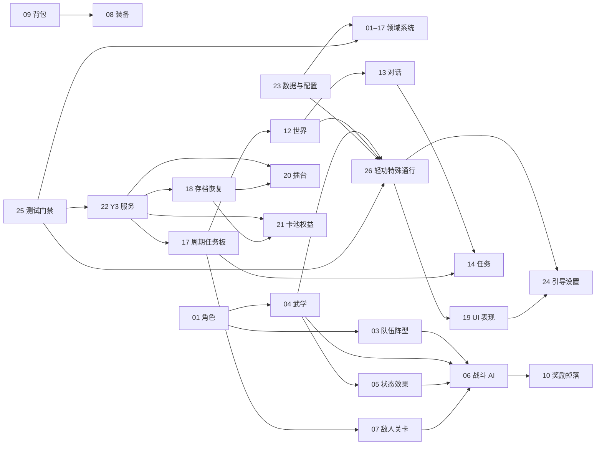

# 《雾州侠行》系统工程规格索引

> 状态：系统规格初稿完整，已完成第一轮结构与跨系统所有权审计；待实现前按验收项逐项评审
>
> 本目录保存可执行工程规格，不包含实际游戏代码。所有文档共同遵守[通用工程约定](./00-通用工程约定.md)。

## 文档清单

| 编号 | 系统 | 文档 |
|---:|---|---|
| 00 | 通用工程约定 | [00-通用工程约定](./00-通用工程约定.md) |
| 01 | 角色与属性 | [01-角色与属性](./01-角色与属性.md) |
| 02 | 伙伴与好感 | [02-伙伴与好感](./02-伙伴与好感.md) |
| 03 | 队伍与阵型 | [03-队伍与阵型](./03-队伍与阵型.md) |
| 04 | 武学 | [04-武学系统](./04-武学系统.md) |
| 05 | 状态与效果 | [05-状态与效果](./05-状态与效果.md) |
| 06 | 确定性战斗与 AI | [06-确定性战斗与AI](./06-确定性战斗与AI.md) |
| 07 | 敌人、关卡与首领 | [07-敌人关卡与首领](./07-敌人关卡与首领.md) |
| 08 | 装备、强化与淬炼 | [08-装备强化与淬炼](./08-装备强化与淬炼.md) |
| 09 | 背包与物品 | [09-背包与物品](./09-背包与物品.md) |
| 10 | 经济、奖励与掉落 | [10-经济奖励与掉落](./10-经济奖励与掉落.md) |
| 11 | 经脉与长期成长 | [11-经脉与长期成长](./11-经脉与长期成长.md) |
| 12 | 世界探索 | [12-世界探索](./12-世界探索.md) |
| 13 | NPC 交互与对话 | [13-NPC交互与对话](./13-NPC交互与对话.md) |
| 14 | 任务与记录簿 | [14-任务与记录簿](./14-任务与记录簿.md) |
| 15 | 门派与声望 | [15-门派与声望](./15-门派与声望.md) |
| 16 | 制作与商店 | [16-制作与商店](./16-制作与商店.md) |
| 17 | 悬赏、委托与可信周期 | [17-悬赏委托与刷新](./17-悬赏委托与刷新.md) |
| 18 | 存档、迁移与恢复 | [18-存档迁移与恢复](./18-存档迁移与恢复.md) |
| 19 | UI、输入与表现 | [19-UI输入与表现](./19-UI输入与表现.md) |
| 20 | 异步擂台与赛季 | [20-异步擂台与赛季](./20-异步擂台与赛季.md) |
| 21 | 卡池、商城与权益 | [21-卡池商城与权益](./21-卡池商城与权益.md) |
| 22 | Y3 原生服务适配 | [22-Y3原生服务适配](./22-Y3原生服务适配.md) |
| 23 | 数据生成与配置校验 | [23-数据生成与配置校验](./23-数据生成与配置校验.md) |
| 24 | 新手引导与设置 | [24-新手引导与设置](./24-新手引导与设置.md) |
| 25 | 测试、诊断与发布门禁 | [25-测试诊断与发布门禁](./25-测试诊断与发布门禁.md) |
| 26 | 轻功探索与特殊通行 | [26-轻功探索与特殊通行](./26-轻功探索与特殊通行.md) |

## 推荐阅读顺序

1. 先读 00、23、18，理解公共契约、配置和存档边界。
2. 核心战斗开发读 01、03、04、05、06、07、08。
3. 世界内容开发读 02、09–17、24、26；轻功通行还需先读 04 与 12。
4. 平台与发布开发读 19–22、25。

## 如何把规格转成实施任务

每份 01–26 文档都是一个系统的工程合同，不是概念介绍。开始实现某系统前，按固定顺序执行：

1. 先关闭该文档“待决项”中会改变数据结构、所有权或玩家规则的事项；纯内容数值可继续保留为配置待定。
2. 冻结领域类型、稳定 ID、命令、事件、错误码、配置 Schema 和存档 DTO，并让 23 的生成校验先通过。
3. 先完成纯 Lua 状态机、公式、幂等和故障测试，再接应用用例；领域代码不得调用 `y3.*`。
4. 经 18 SaveCoordinator 接入存档和恢复，再接 Y3 适配、UI 和表现；UI 只能提交命令，不能写持久事实。
5. 导入首章内容，逐条运行该文档测试矩阵与验收标准；未满足退出条件时不能把系统标记为完成。

每个实施任务的完成证据至少包括：变更的 Schema/接口、通过的自动测试、一次 Y3 引擎验证、存档兼容结论、失败恢复记录和对应文档更新。任务只按依赖和验收结果推进，不附日历或人员规模估算。

## 关键依赖关系

26 的探索 TraversalGrid/TraversalCell 是地图上的离散可达格系统，不复用 03 的战斗 3×3 阵位。19 只显示有效/无效/悬停/路线与落点并提交输入，确认时由 26 按六项 `ReachabilitySourceVector` 和动态阻挡重新校验；23 负责格子预烘焙、稳定 ID、世界图可达与强制路线能力来源校验，25 负责 Y3 表现、性能和安全恢复门禁。

## 跨系统事务所有权

| 业务事务 | 发起/判定系统 | 唯一写入所有者 |
|---|---|---|
| 战斗与关卡结算 | 06 生成不可变 CombatFinished，07 校验并结算 Encounter | 07 写 run/结算，10 发奖励；14 只消费含 settlement receipt 的 EncounterCompleted |
| 装备生成与词条 | 08 装备生成实例内容 | 09 背包维护所有权；槽 4 协调提交 |
| 任务完成与奖励 | 14 任务判定完成并发起 Saga | 各资源/养成所有者写 child receipt，14 写任务终态；SaveCoordinator 前向恢复 |
| 制作/购买 | 16 校验配方、库存与价格 | 09/10/16 作为槽 4 section owner，由 SaveCoordinator 单槽提交 |
| 角色/武学付费权益入账 | 21 校验平台单调权益游标并派生子收据 | 01/04 写各自拥有状态；21 保存唯一平台权益游标 |
| 擂台挑战结算 | 20 校验快照、intent 和积分 | 20 拥有槽5 arena section，SaveCoordinator 提交；22 适配发布槽101 |
| 付费抽取与权益 | 21 管理状态机、单调计数和对账 | 平台整数槽为权益权威；21 独占私人交付游标，01/04 接受派生子收据 |

任何实现若需要改变上表所有权，必须先更新相关系统文档和架构决策，不能在适配器或 UI 中新增旁路写入。

## 架构决策

- [ADR-0001：系统所有权矩阵](../architecture/ADR-0001-系统所有权矩阵.md)
- [ADR-0002：跨槽可恢复事务](../architecture/ADR-0002-跨槽可恢复事务.md)
- [ADR-0003：身份与事件字典](../architecture/ADR-0003-身份与事件字典.md)
- [ADR-0004：公开快照与规则版本](../architecture/ADR-0004-公开快照与规则版本.md)

跨槽业务统一采用 PREPARED → owner child receipts → RECOVERY_REQUIRED/COMMITTED 的前向恢复模型；“原子”只用于能够由同一 owner 槽一次提交的本槽变更。
