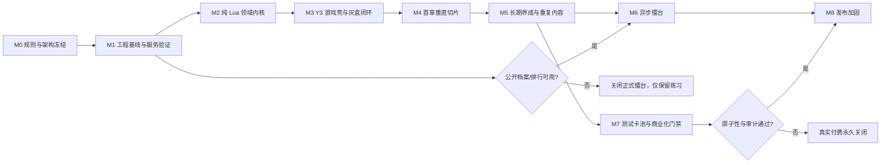

# 《雾州侠行》实施计划

> 文档状态：实施中；工程开工闸门、角色属性纯 Lua 领域切片、角色持久化离线契约，以及系统 10 最小密封 RewardCatalog authority 持续落地，其余玩法系统与正式内容尚未开始
>
> 依据文档：[《雾州侠行》Y3 游戏系统与服务蓝图](./雾州侠行-Y3游戏系统与服务蓝图.md)
>
> 叙事基线：[《雾州侠行》世界观与主线改编案](./雾州侠行-世界观与主线改编案.md)
>
> 逐系统工程规格：[《雾州侠行》系统工程规格索引](./systems/README.md)
>
> 当前边界：已开始 M2 纯 Lua 领域内核；系统 01 已落地配置形状与目录语义、角色聚合、阅历/等级、结构化等级奖励映射及其纯计划摘要、主属性与战斗属性流水线，以及槽 3/5 SaveCodec、section 注册、受保护仓储端口和离线 Fake。系统 10 已落地最小密封 `RewardCatalog`/`RewardBundle`、一层嵌套展开、升级奖励禁止 `CHARACTER_XP` 叶子的跨表校验，以及 `CharacterRules` 可选绑定。离线 `CharacterWriteService` 已覆盖创建/授阅历/改名/详情查询；最小离线 `SaveCoordinator` + MemorySaveStore 已覆盖 stage→commit、冲突拒绝与 UNKNOWN 对账。经济账本/发奖事务、完整 LoadGameSave/迁移/Manifest-last、生产 Y3 云存档、战斗快照用例、UI 与正式内容仍未落地；Fake 故障注入也不代表真实平台故障语义已经验证。

## 1. 目标与版本边界

### 1.1 目标版本

实施分成三个可独立验收的版本，避免把首章、在线系统和商业化绑成一个不可控的大版本。

| 版本 | 范围 | 完成标志 |
|---|---|---|
| V0 技术样片 | 一地区、一条短任务链、两人队伍、一场首领战、一组轻功格/基础跳跃/踏水灰盒、保存重进 | 验证架构和关键 Y3 能力，不追求最终美术 |
| V1 首章垂直切片 | 3 地区、5 角色、12 武学、24 装备、8 类敌人、2 首领、主线与 6 支线、离散格轻功探索 | 新玩家无需开发命令可完成 60–90 分钟流程 |
| V2 弱联网候选版 | V1 加长期养成、重复内容、公开阵容和异步擂台 | 在线能力失败时可安全降级，核心单机流程仍可游玩 |
| V3 商业化候选版 | V2 加通过合规门禁的商城和卡池 | 只有原子性、补偿和审计全部通过后才允许开启真实付费 |

明确不进入 V1 的内容：正式擂台、真实付费卡池、深度经脉树、复杂制作、长期剧情分支、实时联机、公会、交易和无缝开放世界。V1 可以保留相关接口和功能开关，但不制作正式运营内容。

### 1.2 当前工程基线

- 当前 Y3 工程为 2.0、2.5D 项目，入口地图为 `EntryMap`；版本与依赖提交已由 `baseline-y3-2.0-v17` 标签冻结。
- Y3 开发助手作为外部工具链锁定，`y3-lualib` 以子模块固定版本；自动保存已关闭。
- `wzx` 分层骨架、Foundation V1 公共契约、六个服务端口/Fake、安全关闭启动壳与 Lua 5.1 离线门禁已经建立。
- 系统 01 已落地纯 Lua 领域切片，以及槽 3/5 SaveCodec、section 注册、受保护仓储端口和离线 Fake；尚未实现应用用例，也未注册到 gameplay bootstrap。
- 地图入口已移除模板计时器和按键示例；当前只启动 `FOUNDATION_ONLY` 壳，不注册玩法系统，所有未验证平台功能默认关闭。
- 云存档槽和公开存档键尚未在工程中配置。
- Y3 定制 Lua 5.4 同黄金向量、真实账号平台服务和轻功灰盒仍待引擎侧验证；这些状态必须保持“未验证”，不能由离线 Fake 结果替代。

## 2. 总体实施顺序



关键路径为：工程基线 → 数据契约 → 领域内核 → 应用流程 → Y3 表现与轻功选点灰盒 → 灰盒闭环 → 首章内容 → 发布加固。

可并行工作：

- Y3 云存档、公开档案、排行榜、服务器时间、商城和随机池验证可与离线领域内核并行。
- 配置表结构冻结后，内容策划可与战斗开发并行填充角色、武学、敌人和任务。
- UI 信息架构可以提前设计，但正式接入应等待应用接口和领域事件格式稳定。
- 地图灰盒可提前制作；TraversalGrid/Cell 烘焙、Point SceneUI/地面特效选点验证与地图碰撞尺寸并行，最终美术、音效和演出应在玩法尺寸稳定后替换。

## 3. 阶段实施清单与退出条件

### M0：规则、范围与架构冻结

主要任务：

- 建立版本控制、工程基线备份、分支和发布标签规则。
- 冻结 V0、V1 的进入范围与不进入范围。
- 定义核心类型、六个服务接口、错误码和结果对象；轻功部分冻结 `LightnessTraversalProfile/TraversalGrid/TraversalCell/TraversalLink/WaterSurfaceZone/TraversalSession`。
- 定义稳定 ID 命名规则、配置引用规则、存档版本与修订号规则。
- 定义 `CombatEvent` 事件格式、战斗快照版本和确定性约束。
- 冻结轻功能力枚举、格/连接 ID 前缀、`RequestTraversal`、`TraversalLanded`、`WaterWalkEntered`、`WaterWalkExited`、踏水总会话/嵌套逐段选点、安全恢复、六项 `ReachabilitySourceVector`，以及 26 提供 canonical tuple、12 生成并提交、18 引用的 `landing_receipt_id` 边界。
- 定义功能开关：`arena_enabled`、`test_gacha_enabled`、`paid_gacha_enabled` 必须互相独立，真实付费默认关闭。
- 建立原创性和素材授权台账，记录所有文本、美术、字体、模型、音效的来源与许可。

交付物：架构说明、数据契约、存档槽规划、配置字典、内容清单、风险登记表、Definition of Done。

退出标准：核心 DTO、事件、ID、存档边界和降级策略没有阻塞性未决项；V1 范围评审通过；真实付费默认关闭。

### M1：工程基线与 Y3 原生服务风险验证

主要任务：

- 验证 Y3 编辑器、开发助手、`y3-lualib`、Lua 5.1、热重载、独立测试和错误日志链路。
- 用最小验证地图完成云存档往返、下载失败、写入失败和重进测试。
- 使用两个真实测试账号验证公开档案读取、数据延迟、缺失档和旧版本档。
- 验证排行榜能否取得所需排名数据或 AID、更新延迟和整数边界。
- 验证服务器日期、时区、跨日和服务不可用时的行为。
- 验证商城订单标识、取消、重复回调、延迟回调、补单能力。
- 验证服务器随机池的权威结果、消耗方式、权益写入、异常恢复和审计导出。
- 在最小轻功地图验证 Y3 世界点点击/悬停、Point SceneUI 始终朝镜头与可见性、密集标记池性能、地面特效/标记单位 fallback、`RIGHT_MOUSE_UNIT_MOVE` 输入锁、单位跨层位移、碰撞、水面区域和句柄失效恢复。

交付物：六份服务验证记录，每项标记为“可用、受限、不可用”，并附限制、复现步骤、降级方案和复验入口。

退出标准：

- 空地图能够稳定启动，纯 Lua 测试能在无引擎环境运行。
- 已确认存档槽范围、类型、容量、三层嵌套、频控和整数边界。
- 下载失败时不会创建新档覆盖有效云档。
- 擂台和真实付费卡池分别得到明确的继续、降级或关闭结论。
- 轻功选点至少一种 Y3 marker 方案通过键鼠、性能与回收验证；跳跃/踏水中断能校准到安全 TraversalCell，未验证时不得把特殊通行放入主线强制路线。

### M2：纯 Lua 领域内核

主要任务：

- 建立配置 Schema、稳定 ID 注册表、引用校验和生成前检查。
- 实现角色属性、队伍、3×3 阵型、武学、效果、装备、背包、奖励和经济模型。
- 实现自有确定性随机源、速度行动、聚气、普通攻击、绝招、状态叠加、AI、首领阶段，以及“第 99 个行动完整结算后仍无胜负即超时”的边界。
- 实现任务状态机、对话条件、奖励幂等、隐藏事件条件和任务断链校验。
- 实现纯 Lua TraversalGrid/Cell 图、普通边与 TraversalLink 覆盖、LightnessTraversalProfile 候选计算、WaterSurfaceZone、RequestTraversal 二次校验、跳跃短会话、踏水总会话/逐段 command/嵌套选点，以及安全恢复规则；踏水入口、内部格和出口只累计扣除 `water_range_cells`。
- 实现格/连接/水域引用、隐藏格、防剧透、主线世界图可达和强制路线能力来源校验；预览候选使用完整来源向量且任一分量变化即过期。
- 实现存档 Envelope、各槽数据结构、修订号、幂等迁移和非法数据拒绝。
- 建立 Fake 服务、单元测试夹具、固定快照和黄金事件哈希。

当前进度（2026-08-04）：系统 01 已完成角色持久化 DTO/Codec、section 注册、受保护仓储端口与离线 Fake 的代码落地；业务 `receipt_id`、SaveCoordinator 提供的外部原子 `transaction_id` 和传输 `context.idempotency_key` 已按不同身份分离，RuntimeId component 的首字符规则与禁止身份原值复用已经冻结。角色事务查询要求原传输键、原命令、`expected_result_digest`、`expected_character_save_revision` 在内的完整证明 tuple，并严格区分非 COMMITTED 回显与 COMMITTED 结果。`LevelCurve` 现要求 `experience_cap`，并把 `level_reward_refs` 冻结为最多 64 行、等级严格递增的 `{ reached_level, reward_ref }[]`；省略/空值规范化为空数组，旧非空扁平数组失败关闭。纯规则层可按 `(old_level, new_level]` 生成受信的 `reward_ref_count` 与上下文绑定的 `reward_plan_digest`。系统 10 最小密封 `RewardCatalog` 已可校验 `reward_*` 包、一层 `REWARD_BUNDLE` 嵌套、叶子展开，以及升级奖励路径禁止 `CHARACTER_XP`；`CharacterRules.bind(character_catalog, reward_catalog)` 可在计划阶段执行该校验。离线 `CharacterWriteService` 已覆盖 `CreateOwnedCharacter`、`GrantCharacterExperience`、`RenameProtagonist`、`GetCharacterDetail`。最小离线 `SaveCoordinator` 已可构建 SaveEnvelope（确定性 payload checksum / owner fingerprint）、分配 transaction/checkpoint ID、多槽 stage→commit、load 与 UNKNOWN 对账；MemorySaveStore 提供可写 Fake。货币账本、EconomyTransactionPort、完整 LoadGameSave/迁移/Manifest-last 与生产 Y3 适配仍未接入，生产发奖与生产存档保持关闭。真实 Y3 的超时、频控、不可用、写后响应丢失及其归一化映射也均未经过平台故障注入，M1 平台退出标准仍未满足。

创建结果现已把严格排序的天赋列表数量与规范摘要绑定进 `result_digest`，关闭了默认天赋在同一持久证明下被替换的路径；来源与默认天赋 catalog 权威仍留在后续应用用例层，不由仓储自行猜测。

交付物：可在 Lua 5.1 独立运行的领域层与测试报告，不要求 Y3 模型和 UI。

退出标准：

- 领域层没有任何 `y3.*` 调用。
- 战斗结果不依赖 `math.random`、系统时间或不稳定的 `pairs` 遍历顺序。
- 相同快照和种子重复执行得到完全一致的事件日志与哈希。
- 未知 ID、越界等级、非法阵位、旧规则快照和非法权益全部被拒绝。
- 所有存档迁移重复执行仍得到相同结果。
- 相同起点、来源向量和配置得到相同 TraversalCell 候选集/路径哈希；预览不能改变位置，确认时动态阻挡或能力变化必被拒绝。

### M3：应用层、Y3 适配器与 V0 灰盒闭环

主要任务：

- 编排探索、轻功选点/确认/取消/安全恢复、交互、对话、任务、编队、开战、结算、领奖和保存用例。
- 接入 Y3 单位、区域、镜头、点击移动、WASD、声音和 UI 适配器。
- 建立战斗表现队列，用 `CombatEvent` 驱动动画、位移、跳字、特效、血条和镜头。
- 建立轻功覆盖层和 marker pool：显示陆地有效、水面有效、无效、悬停、路线、落点与原因；鼠标/键盘共享 Open/Move/Confirm/Cancel 动作，确认才同步调用 RequestTraversal。
- 打通“城镇灰盒 → NPC 对话 → 接任务 → 野外战斗 → 掉落 → 装备 → 首领 → 领奖 → 保存重进”的最薄闭环。
- 接入只读重试页、重复点击防护、重复回调幂等和关键节点自动保存。

交付物：V0 技术样片、灰盒地图、完整事件日志、保存重进录像或验收记录。

退出标准：

- 点击移动和 WASD 都能完成灰盒流程。
- 鼠标和键盘均能完成选点、基础跳跃、踏水进入/移动/离开与取消；覆盖层不是战斗 3×3 网格，隐藏格不会被预览泄漏。
- 动画、SceneUI 和本地点击不能决定成功；只有权威 `TraversalLanded`、`WaterWalkEntered`、`WaterWalkExited` 推进状态，输入锁和 marker pool 在全部退出路径恢复。
- 剧情战可切换手动绝招与全自动，切换不改变已确定的战斗规则。
- 表现播放速度、跳过动画或掉帧不会改变领域结果。
- 保存重进后任务、角色、装备、阵型和奖励状态一致。
- 断线、重复回调和重复点击不会重复发奖。

### M4：V1 首章垂直切片

主要任务：完成第 5 节的全部内容矩阵；接入探索 HUD、轻功格选点、跳跃/踏水教学、对话、任务簿、角色、武学、背包、装备、阵型、商店、战斗、结算和设置界面；完成首轮数值、经济、候选格性能与新手体验调优。

交付物：首章 Content Complete 构建、完整新手引导、平衡报告、全流程测试清单和已知问题清单。

退出标准：

- 新档无需开发命令可连续游玩 60–90 分钟。
- 四条武器路线均能完成首章，五名角色均可正常招募和编队。
- 主线、6 支线和两种重复任务没有断链、死锁或不可满足条件。
- 没有体力、等待或付费机制阻断主流程。
- 一处必经基础跳此前保证获得 JUMP_BASIC；两处高级跳和一处踏水区均为可选内容，WATER_WALK 不成为唯一主线门槛。
- 8 单位战斗和密集 TraversalCell 覆盖层在目标设备上稳定；跳跃/踏水断线恢复安全，存读档不丢任务、装备、阵容或设置。

### M5：长期养成与轻重复内容

主要任务：门派、浅层经脉、制作、强化、淬炼、好感；悬赏、门派委托、资源刷新和副本循环；服务器日期刷新；完整货币来源/消耗矩阵和防通胀检查。

退出标准：修改本地时间不能重复领取；服务器日期不可用时暂停相关领奖而不回退进度；重复内容不限制主线、野怪和普通副本；每类货币都有主要来源和主要消耗点。

### M6：异步擂台

依赖稳定战斗内核、快照版本、公开档案、排行榜和服务器时间。

主要任务：公开最小阵容快照、严格反序列化、AID 对手读取、阵容重建、28 天赛季、积分、每日首次计分、练习模式、确定性复盘和赛季迁移。

退出标准：

- 两个真实账号能够互相读取公开快照并挑战。
- 快照只接受白名单 ID、等级和合法词条；全部派生属性由本地合法配置重算。
- 同一对手每天仅首次胜利计分，防守方离线不扣分。
- 旧赛季排序、积分上下界和排行榜整数编码通过边界测试。
- 平台能力不满足时，正式擂台关闭并降级为本地机器人练习。

### M7：测试卡池与商业化门禁

本阶段可与 M6 独立并行，但不进入 V1 关键路径。

主要任务：先实现测试币角色池与武学池、保底、重复转化、兑换和迁移；再验证商城订单、权益整数槽、私人存档对账、概率页、抽取记录和异常补偿。

退出标准：

- 崩溃、超时、取消和重复商城回调不吞单、不重复发货。
- 保底跨同类型卡池继承，迁移后计数不丢失。
- 正式结果只能来自 Y3 服务器随机池，客户端不能指定奖励。
- 只有确认“扣除凭证—产生结果—写入权益”具备原子性或完整可恢复机制，并能导出至少 90 天审计记录后，才允许打开真实付费开关。
- 任一门禁失败时，正式版继续关闭真实付费卡池，仅保留测试币池。

### M8：发布加固与封闭测试

主要任务：全量回归、性能、弱网、断线、坏档、迁移、故障注入和长时间稳定性测试；全新账号、老档升级、跨账号擂台三条回归路径；原创性、素材授权、概率公示、适龄和未成年人保护检查；封闭测试与 RC 回滚演练。

退出标准：P0/P1 缺陷为零；没有覆盖云档、重复发权益或污染排行榜的已知高风险缺陷；付费功能状态与门禁结论一致且不能被普通配置误开启；候选版本具备明确回滚和兼容方案。

## 4. 计划中的技术目录与依赖纪律

以下目录为当前已经启用并继续扩展的目标结构；未列出的业务子目录按对应系统开工时创建：

```text
maps/EntryMap/script/wzx/
├─ bootstrap/                 # 启动顺序、依赖注入、功能开关
├─ domain/                    # 纯 Lua，禁止引用 y3.*
│  ├─ common/
│  ├─ character/
│  ├─ combat/
│  ├─ quest/
│  ├─ inventory/
│  ├─ progression/
│  ├─ traversal/
│  ├─ arena/
│  ├─ gacha/
│  └─ save/
├─ application/
│  ├─ ports/
│  ├─ use_cases/
│  ├─ sessions/
│  └─ controllers/
├─ adapters/
│  ├─ y3/
│  │  ├─ services/
│  │  ├─ world/
│  │  ├─ presentation/
│  │  └─ ui/
│  └─ fake/
├─ config/
│  ├─ schema/
│  └─ generated/
├─ tests/
│  ├─ unit/
│  ├─ integration/
│  ├─ fixtures/
│  └─ golden/
└─ tests/                    # 显式清单的纯 Lua 离线门禁

design/data-source/           # Excel 原始内容表
docs/architecture/            # 架构说明
docs/service-validation/      # Y3 服务验证报告
docs/release-checklists/      # 发布门禁
tools/test.ps1                # Lua 5.1 语法、边界与测试总入口
```

依赖纪律：

- `domain` 只能依赖 Lua 标准能力和本项目纯 Lua 公共模块。
- `application` 只能依赖 `domain` 与 `ports` 中的抽象接口。
- `adapters` 负责把 Y3 数据转换为领域 DTO，不向领域层泄漏 Y3 句柄。
- `bootstrap` 是唯一组装领域、应用和适配器的入口。
- 表现层只消费 `CombatEvent`，不得直接修改战斗状态。
- 轻功表现层只消费 RequestTraversal 结果与 TraversalEvent；TraversalCell 覆盖层、动画、SceneUI 和本地鼠标事件都不是位置权威。
- 战斗和擂台快照只保存稳定 ID、等级、阵位和合法随机词条，不保存可伪造的最终攻击力等派生数值。

## 5. 首章内容制作计划

以下名称为原创工作名，可在 M0 叙事冻结时调整。

### 5.1 内容矩阵

| 类型 | 数量 | 首章计划 |
|---|---:|---|
| 地区 | 3 | 雾津驿：枢纽与教学；乌檀岭：探索、采集、分支与第一首领；沉钟院/地下钟窟：机关与终局首领 |
| 轻功地形 | 1 必经基础跳 + 2 可选高级跳 + 1 可选踏水区 | 三地区关键地形烘焙 TraversalGrid/Cell；必经跳此前保证获得 JUMP_BASIC；高级跳与踏水用于隐藏捷径、采集或教学支路，不封锁主线 |
| 可用角色 | 5 | 主角；梁既白（枪棍/护卫）；苏见微（剑/治疗净化）；霍小满（刀/流血收割）；闻鹤生（拳/反击控制） |
| 武学 | 12 | 拳、剑、刀、枪棍套路各 1；内功 4；轻功 4。每门轻功配置 LightnessTraversalProfile，探索能力覆盖 JUMP_BASIC、JUMP_LONG、JUMP_HIGH、WATER_WALK |
| 装备 | 24 | 四系武器各 3，共 12；头部、衣甲、饰品各 4，共 12；首章仅使用 6 种随机词条 |
| 普通敌人 | 8 | 刀手、弩手、盾卫、药师、雾狼、岩猿、伏击客、钟院弟子 |
| 首领 | 2 | 岭上匪首·柯砺山：护卫与后排点杀；钟窟守院人·孟缄声：两阶段、召唤、可打断蓄力 |
| 任务 | 1 主线 + 6 支线 | 主线《第一卷·钟下无名》约 55–65 分钟；支线分别教学搜索、采集、制作、阵型、隐藏地点和伙伴好感 |
| 重复内容 | 2 | 悬赏、驿站委托；仅补充循环，不限制主线 |

角色建议在约 0、10、25、40 分钟逐步加入，第五人形成第一次真正的替补选择。武学配置支持十重，但首章正常资源只支持升至 3–4 重，避免为了未来上限制造首章数值膨胀。

教学随流程分散触发：移动 → 打开轻功格选点/识别范围/悬停路线/确认/取消 → 基础跳跃 → 可选踏水 → 交互与战斗 → 聚气绝招与自动模式 → 装备和武学 → 编队换位 → 制作与传送。所有教学可跳过并可在帮助页重看；跳过不授予能力、不创建 TraversalSession、不移动角色。

### 5.2 内容制作顺序

1. 冻结 ID、配置表、主线流程图、角色加入点、轻功能力取得点、TraversalGrid/Cell 和首章数值基线。
2. 先完成“城镇灰盒 → 轻功选点/基础跳 → 对话 → 任务 → 两人战斗 → 掉落 → 装备 → 存档”闭环。
3. 战斗规则稳定后批量制作 12 武学、8 类敌人和 2 名首领。
4. 灰盒化三个地区，烘焙 TraversalCell、配置一处必经基础跳/两处高级跳/一处可选踏水区并接入完整主线，再加入角色招募和 6 条支线。
5. 接入背包、商店、锻造、阵型、重复任务与含轻功选点/踏水的分段教学。
6. 最后替换美术、音效和演出，并进行数值、性能和全流程回归。

### 5.3 范围控制

- V1 的昼夜系统只服务一个条件事件，不制作完整生态变化。
- 24 件装备复用不超过 8 套外观；8 类敌人优先复用 4 套骨骼和动画。
- 支线允许局部选择，但不制作影响后续章节的大型分支树。
- 当验证结果要求收缩首章范围时，按“隐藏演出 → 支线分支 → 环境机关复杂度”的顺序削减。
- 不削减最薄核心闭环、四系可通关能力、必经基础跳的保证能力来源、存档安全和首章结局；高级跳/踏水支路可缩短但不能改成未经权威校验的瞬移。

## 6. 数据生产与校验流程

1. 策划只修改 `design/data-source` 中的源表。
2. 生成工具先验证重复 ID、字段类型、概率和为 100%、引用断链、循环前置、无法完成的任务条件、TraversalGrid/Cell 烘焙、危险落点、隐藏格泄漏、世界图不可达和强制路线能力来源。
3. 校验通过后生成只读 Lua 配置和必要的 Y3 物编条目。
4. 生成结果禁止手工修改；差异应可审查并记录生成器版本。
5. 领域测试加载生成配置，完成快照、任务可达性、掉落、战斗、轻功候选集/路径哈希和确认重校验冒烟测试。
6. Y3 引擎只消费通过校验的生成结果。

建议稳定 ID 前缀：`char_`、`martial_`、`effect_`、`equip_`、`enemy_`、`encounter_`、`quest_`、`dialogue_`、`shop_`、`banner_`；轻功通行冻结为 `traversal_profile_`、`traversal_grid_`、`traversal_cell_`、`traversal_link_`、`water_zone_`。数字物编 Key 只能存在于 Y3 适配映射表中。

## 7. Y3 原生服务验证矩阵

| 服务 | 必验问题 | 通过标准 | 未通过时处理 |
|---|---|---|---|
| 云存档 | 槽类型、容量、三层嵌套、频控、部分失败和冲突语义 | 往返一致；下载失败不写入；修订号可识别旧写入 | 进入只读重试，禁止新档覆盖 |
| 公开档案 | `open_archive_key`、跨账号读取、延迟、陈旧数据和隐私边界 | 两账号读取一致；缺失和旧版本可识别 | 关闭正式擂台，保留本地练习 |
| 排行榜 | 附近排名或 AID、刷新延迟、整数范围和赛季编码 | 跨账号更新和跨赛季排序正确 | 仅显示本地成绩 |
| 服务器时间 | 时区、跨日、单调性和不可用行为 | 日刷新只由可信服务器日期驱动且不重复 | 使用最后可信日期并暂停领奖 |
| 平台商城 | 订单标识、取消、重复回调、延迟回调、补单查询 | 回调重放不重复发货，异常中断可恢复 | 隐藏所有付费入口 |
| 服务器随机池 | 权威结果、消耗、权益原子性、异常恢复和日志导出 | 故障注入不吞单不重发，审计可导出 | 真实付费卡池保持关闭 |

外部前置条件：至少两个可发布测试账号、测试商城商品、测试随机池、排行榜配置权限和能够查看平台日志的账号。缺少这些条件时只记录为“未验证”，不能推断为可用。

## 8. 测试策略与发布门禁

### 8.1 测试分层

- 约 65% 为纯 Lua 单元测试与属性测试：公式、行动序、状态、AI、任务、掉落、迁移、保底和积分。
- 约 25% 为 Fake 服务契约与 Y3 适配器集成测试：云档、公开档、排行、时间、商城和随机池。
- 约 10% 为 Y3 引擎端到端、兼容性、性能和人工体验测试。

执行节奏：每次提交运行配置断链检查和关键单测；持续集成运行全量回归和固定种子哈希；候选版本运行故障注入、长时间稳定性、全新账号、老档升级和跨账号挑战。

### 8.2 硬门禁

- P0/P1 缺陷为零才能进入候选发布。
- 同一快照与种子的事件哈希必须完全一致；至少 10,000 组固定/随机种子回归无漂移。
- 所有已发布存档版本都必须能迁移到当前版本，且迁移幂等。
- 模拟任一存档槽写入失败时，不得覆盖仍有效的云档。
- 擂台重复结算、跨日、赛季边界、同对手首次计分全部正确。
- 商城重复、延迟、取消和超时回调不得重复发权益。
- 卡池概率配置与保底规则必须做精确校验；大样本统计仅用于发现异常，不能替代配置和事务审计。
- 六项 `ReachabilitySourceVector` 任一变化时旧预览必须失效；确认只通过 RequestTraversal，隐藏格不得进入玩家可见候选。
- 鼠标/键盘选点、跳跃落点、踏水父/子会话与逐段幂等、唯一水面预算、换装阻止、断线安全恢复、26/12/18 落地收据对账、`RIGHT_MOUSE_UNIT_MOVE` 锁归还和 marker pool 回收全部通过；密集格表现达到登记目标设备基线。

### 8.3 首章体验验收

- 首次玩家完成时间中位数目标为 70–85 分钟。
- 主线、6 支线和两种重复任务都能闭环。
- 五名角色可招募，四条武器路线均能通关。
- 一处必经基础跳、两处可选高级跳和一处可选踏水区按设计可达；WATER_WALK 不成为唯一主线门槛。
- 首次跳跃/踏水教学可跳过但不改变能力或权威位置；鼠标、键盘、色弱和低特效路径均可完成选点。
- 两名首领的机制有明确预警、可理解反制且不存在必败组合。
- 保存重进不丢任务、装备、阵容、武学或卡池测试状态。
- 8 单位战斗在预先登记的最低目标设备上保持稳定帧率。
- 密集 TraversalCell 覆盖层使用池化标记或通过验证的 fallback，在最低目标设备与支持分辨率下无显著回退、隐藏格剧透或输入锁泄漏。

## 9. 主要风险与应对

| 风险 | 等级 | 预防与降级 |
|---|---:|---|
| Y3 无法保证扣款—抽取—权益原子性 | P0 | 只开放测试币池；取得书面能力确认并完成故障注入后再评估 |
| 平台审计、实名、防沉迷或未成年人消费能力不满足 | P0 | 平台与法务联合验收；不通过则不商业化 |
| 多槽云档部分成功导致丢档 | P0 | 使用修订号、提交清单、版本校验、只读恢复和关键节点备份策略 |
| 参考作品相似度过高或素材授权不清 | P0 | 原创审查、逐资产授权台账、命名与剧情相似度复核 |
| 排行榜或公开档案可伪造、陈旧或跨赛季污染 | P1 | 白名单反序列化、范围校验、快照哈希和规则版本隔离 |
| Lua 遍历顺序、浮点或时间源破坏确定性 | P1 | 注入 PRNG/时钟、显式排序、整数化关键公式和黄金哈希 |
| 回滚后新存档无法被旧版本读取 | P1 | 延迟不可逆迁移，保留前一版本兼容路径和发布前升级演练 |
| 首章内容量拖延系统验收 | P1 | V0 先闭环；M4 范围冻结；延期按既定次序削减非核心内容 |
| UI 与表现反向控制规则导致难以测试 | P1 | 表现只消费事件；所有权威状态留在领域层 |
| 轻功预览被当成权威或陈旧格仍可确认 | P1 | 完整来源向量、candidate_set_hash、RequestTraversal 二次校验和同 command_id 幂等 |
| Point SceneUI 密集格性能或命中不可靠 | P1 | marker pool、视距/批次预算；灰盒实测后切换地面特效或标记单位 fallback |
| 跳跃/踏水中断导致卡在水中或危险落点 | P1 | 每个落点配置 SAFE_GROUND marker、每个水域配置 safe shore markers；全阶段断线、换装和句柄失效故障注入 |
| 缺少双账号和平台测试权限 | P1 | 擂台与付费功能标记为未验证并保持关闭，不阻塞离线首章 |

## 10. 实施启动清单

### 第一批：基线与契约

- 建立 Git 基线、备份和忽略规则。
- 记录 Y3、开发助手、`y3-lualib` 和 Lua 版本。
- 建立目标目录、启动入口和独立测试入口。
- 冻结稳定 ID、核心类型、六个服务接口和错误码；包含 26 的全部 canonical 通行类型、能力枚举、输入动作、事件和来源向量。
- 冻结存档槽 Schema、版本/修订号和功能开关。
- 完成角色、武学、装备、敌人、任务、对话、TraversalGrid/Cell/Link/WaterSurfaceZone 表头评审。

### 第二批：最小验证与第一道门禁

- 建立 Fake 服务与最小领域测试。
- 验证云存档表的三层嵌套、往返、失败和重进。
- 使用双账号验证公开档案和排行能力。
- 验证服务器日期跨日行为。
- 建立轻功最小地图，验证格预烘焙、Point SceneUI/备选 marker、鼠标/键盘、输入锁、跳跃/踏水和安全恢复。
- 建立商城、随机池验证用例，但不开放真实付费。
- 输出 M1 第一版服务矩阵，标记阻塞项、所属系统和下一次复验条件。

完成以上批次时只要求“测试框架可运行、接口冻结、风险有证据”；不要求完成正式地图、美术或首章内容。

## 11. 项目节奏与完成定义

- 每个可交付增量都维护可运行构建、任务清单、风险登记和已知问题清单。
- 每个里程碑开始前确认输入条件，结束时用退出标准验收，不用“代码已写完”代替完成。
- 新增范围必须同时写明增加的实现、测试和存档兼容成本；未批准内容进入后续版本池。
- 任何触及存档、权益、排行榜或付费的变更必须经过独立复核和故障路径测试；复核证据写入发布记录。
- 每个系统的完成定义至少包含：配置可生成、领域测试通过、Y3 冒烟通过、失败路径可恢复、存档兼容、文档更新和无 P0/P1 已知缺陷。

## 12. 正式启动条件

用户已于 2026-08-04 明确授权补齐工程开工条件，M0/M1 的纯工程基础已完成离线实现与回归。当前授权边界限定为：

1. 建立版本控制和业务目录；
2. 创建纯 Lua 测试入口；
3. 冻结核心接口与存档 Schema；
4. 为六类 Y3 原生服务建立端口、Fake、验证记录与安全降级；真实平台验证仍需账号和平台配置；
5. 不制作正式付费卡池，不接入真实商品。
